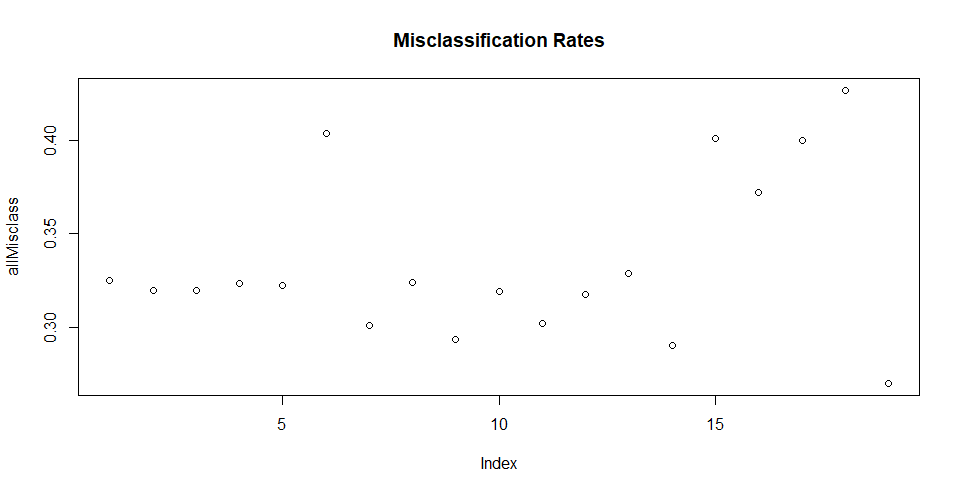

## Contraceptive Method Choice Analysis

This project will be analyzing the contraceptive method choice dataset which is a subset of the 1987 National Indonesia Contraceptive Prevalence Survey. 
“The samples are married women who were either not pregnant or do not know if they were at the time of interview” (archive.ics.uci.edu)

## Method
Using different models we will predict whether a person will use: no contraceptives, short-term contraceptives, or long-term contraceptives. 

## Conclusion

The graph plots all of the misclassification rates for all the models. The model that minimizes the misclassification rate is the 19th model which is circled in red. This model is the random forests model with a misclassification rate of 27.702703%. We will asses this model’s performance one final time.

After computing the random forest model with randomly selecting 736 observations (about half of the total observations) and 5 variables per iteration we got a misclassification rate using test and train of 29.05405. This is about 2% higher than the previous misclassification rate obtained for this model which suggests there may be some variability in misclassification rate. This would make sense being that there is a degree of randomness in the random forest selection, so the observations and columns chosen for each tree are never the same each time you run it. To solve this we will obtain the mean of 100 iterations of the random forest and that will be the misclassification rate for this model. 

The average misclassification rate of 100 random forest models where 736 random observations and 5 random columns were selected per iteration is 29.61486%. If we accept this as the misclassification rate for our random forest model then model 9, our decision tree with a cp of 0.01 would have the lowest misclassification rate of 29.34783%. This observation is circled in blue on the chart above. 

It is interesting that the next best model to the Random Forest is the decision tree as they use similar methodology. 

## Attribute Information

attribute |	type | details | attribute name in dataSet
----------|------|---------|--------------------------
Wife's age | numerical|----| Wife_age
Wife's education | categorical | 1=low, 2, 3, 4=high | Wife_ed
Husband's education | categorical | 1=low, 2, 3, 4=high | Hus_ed
Number of children ever born | numerical | ----|	Num_children
Wife's religion|	binary|	0=Non-Islam, 1=Islam|	Wife_relig
Wife's now working?|	binary	|0=Yes, 1=No	|Wife_working
Husband's occupation|	categorical|	1, 2, 3, 4|	Hus_occupation
Standard-of-living index|	categorical|	1=low, 2, 3, 4=high|	SOL_index
Media exposure	|binary	|0=Good, 1=Not good	|Media_exposure
Contraceptive method use|	binary|	NO YES| CMC

## Models Used
- Logistic (Linear) Regression
- Decision Trees
- Support Vector Machines
- k-Nearest Neighbors
- Cluster Analysis
- Random Forests

## Credits
This project was created as a final project for the Spring 2020 class Business Intelligence and Consumer Insights at Yeshiva University.

Yeshiva University © [Juliet Nasar]()
